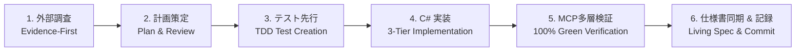

# 開発ワークフローと Living Spec 原則

本ルールは、本リポジトリで作業するすべての AI エージェント（Claude Code / Antigravity / Gemini 等）に適用される恒久的な自律開発プロトコルである。

---

## 1. 完全自律開発ワークフロー（6段階固定プロトコル）

いかなる機能追加・リファクタリング・バグ修正も、必ず以下の 6 段階の順序で実行しなければならない。

| 段階 | 名称 | 具体的な実施内容 | 担当モデル |
|---|---|---|---|
| **Step 1** | **外部調査** | 外部ツール・API・レート制限・トラブルシューティング時は、必ず事前に `search_web` または `read_url_content` で公式仕様・一次情報・実績記事を調査する（推測・決め打ちの全面禁止）。 | Gemini / Claude |
| **Step 2** | **計画策定** | 変更ファイル範囲、asmdef 境界、データ構造、テスト項目を明文化し、人間との合意を形成する。 | Claude / Gemini |
| **Step 3** | **テスト先行** | ロジックの境界値、状態遷移、例外系を網羅する EditMode 単体テストコードを先行して作成する。 | Gemini |
| **Step 4** | **C# 実装** | 3層分離（ロジック・通信・ビュー）、ScriptableObject 純粋関数、不変レコード（`record`）を厳守して C# コードを実装する。 | Gemini |
| **Step 5** | **MCP多層検証** | Unity-MCP の `refresh_unity` を呼び出し、`run_tests` で全テスト（100% Green）を機械的に検証する。必要に応じて PlayMode やシーン結合を検証する。 | Gemini |
| **Step 6** | **仕様書同期 & 記録** | **Living Spec 原則** に従い `docs/spec/CodingSpec.md` をコードと同期更新し、`docs/log.md` および `docs/STATUS.md` に結果を記録して Git コミットする。 | Gemini |

---

## 2. 仕様書不可分の原則（Living Spec Principle）

- **コードと仕様書の完全同期義務**:
  型定義、プロパティ、インターフェース、依存関係、ゲームルールを変更・追加した場合、**同一ターン・同一コミット内で必ず `docs/spec/CodingSpec.md` を最新状態に同期更新しなければならない**。
- **仕様の陳腐化禁止**:
  「コードだけ直して仕様書を放置する」ことを重大な規約違反とする。仕様書が常に最新の真実（Living Document）でなければ、将来起動した別の AI が古い仕様書を読んでハルシネーション（誤ったコード生成）を起こすためである。

---

## 3. 多層検証プロトコル（Multi-Layer Verification）

単体テストのパスのみで開発完了とみなしてはならない。以下の 3 層で検証を行う。

1. **ロジック層（Logic Layer）**:
   - `Game.Core`, `Game.Features.*` の純粋関数およびデータ構造。
   - **検証手段**: Unity-MCP `run_tests`（EditMode）による 100% Green。
2. **ライフサイクル・ビュー層（Lifecycle & View Layer）**:
   - `Game.UI` の MonoBehaviour、EventChannel バインド、`OnEnable`/`Bind` ライフサイクル。
   - **検証手段**: EditMode / PlayMode テストおよびシーン階層・インスペクター参照のバインド検証。
3. **実機・ビルド層（Build Layer）**:
   - WebGL ビルド、アセット参照、フォント（TMP）の描画。
   - **検証手段**: Web ビルド実行およびコンソールエラー 0 件の確認。

---

## 4. 事実と推測の区別および報告プロトコル

- 推測・自己判断による断定発言を禁止する。
- 報告時は必ず以下の **3点セット（証拠付き）** で提示する。
  1. **一次情報源**: 公式ドキュメント URL、公式 CLI 出力、API レスポンス
  2. **検証結果**: スクリプト実行結果、テスト結果（Passed/Failed）、実測値
  3. **判断理由**: 上記の客観的データに基づく結論
