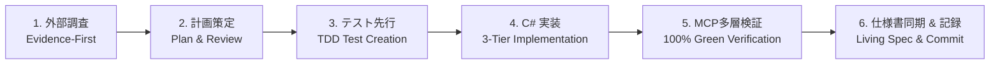

# 開発ワークフローと Living Spec 原則

本ルールは、本リポジトリで作業するすべての AI エージェント（Claude Code / Antigravity / Gemini 等）に適用される恒久的な自律開発プロトコルである。

---

## 1. 完全自律開発ワークフロー（6段階固定プロトコル）

いかなる機能追加・リファクタリング・バグ修正も、必ず以下の 6 段階の順序で実行しなければならない。

| 段階 | 名称 | 具体的な実施内容 | 担当モデル |
|---|---|---|---|
| **Step 1** | **外部調査（条件付）** | 外部ツールの非公開仕様・API・レート制限・未知のエラーに直面した時のみ、`search_web` または `read_url_content` で一次情報を調査する。**通常のゲーム内 C# ロジック実装や既知のテスト作成では検索をスキップし即座にコーディングに着手する**（無駄な検索オーバーヘッドの排除）。 | Gemini / Claude |
| **Step 2** | **計画策定** | 変更ファイル範囲、asmdef 境界、データ構造、テスト項目を明文化し、人間との合意を形成する。 | Claude / Gemini |
| **Step 3** | **テスト先行** | ロジックの境界値、状態遷移、例外系を網羅する EditMode 単体テストコードを先行して作成する。 | Gemini |
| **Step 4** | **C# 実装** | 3層分離（ロジック・通信・ビュー）、ScriptableObject 純粋関数、不変レコード（`record`）を厳守して C# コードを実装する。 | Gemini |
| **Step 5** | **MCP多層検証** | Unity-MCP の `refresh_unity` を呼び出し、高速な `run_tests`（EditMode 100% Green）で機械的に検証する。 | Gemini |
| **Step 6** | **仕様書同期 & 記録** | **Living Spec 原則** に従い `docs/spec/CodingSpec.md` の該当セクションのみをピンポイント差分更新し、`docs/log.md` および `docs/STATUS.md` に結果を記録して Git コミットする。 | Gemini |

---

## 2. 仕様書不可分の原則（Living Spec Principle）

- **コードと仕様書のピンポイント差分同期義務**:
  型定義、プロパティ、インターフェース、依存関係、ゲームルールを変更・追加した場合、**同一ターン・同一コミット内で `docs/spec/CodingSpec.md` の該当セクションのみをピンポイント差分更新する**。
- **無駄な全文再読み込みの禁止**:
  仕様書全体を毎回読み直す・書き直すようなトークン浪費を禁止する。差分変更が生じたセクションのみを最小限のオーバーヘッドで同期すること。
- **仕様の陳腐化禁止**:
  「コードだけ直して仕様書を放置する」ことを重大な規約違反とする。仕様書が常に最新の真実（Living Document）でなければ、将来起動した別の AI が古い仕様書を読んでハルシネーション（誤ったコード生成）を起こすためである。

---

## 3. 多層検証プロトコル（Multi-Layer Verification）

検証作業を開発速度と品質の両立のために以下の通り階層化する。

1. **日常コミット時の検証（最優先・高速）**:
   - Unity-MCP `run_tests`（EditMode 単体テスト、所要時間1秒未満）の 100% Green のみを必須条件とする。
2. **マイルストーン時の検証（Step完了時・週単位の節目）**:
   - シーン結合・ライフサイクル検証（`MainGame.unity` への配置と参照バインド）
   - 実機・ビルド検証（WebGL ビルドの作成およびコンソールエラー 0 件の確認）

---

## 4. 事実と推測の区別および報告プロトコル

- 推測・自己判断による断定発言を禁止する。
- 報告時は必ず以下の **3点セット（証拠付き）** で提示する。
  1. **一次情報源**: 公式ドキュメント URL、公式 CLI 出力、API レスポンス
  2. **検証結果**: スクリプト実行結果、テスト結果（Passed/Failed）、実測値
  3. **判断理由**: 上記の客観的データに基づく結論

---

## 5. デュアルAI非対称待機時の具体的作業カタログ

Claude の 5時間セッション制限中（Gemini 単独稼働時）において、エージェントが自律的に実行してよい作業と禁止作業を以下のように決定論的に定義する。

| 区分 | 具体的作業項目 | 理由 |
|---|---|---|
| **✅ 許可（推奨作業）** | 1. ScriptableObject アセットの実体生成およびカタログ登録 2. シーン（`.unity`）への UI / オブジェクト配置と Inspector 参照バインド 3. モンテカルロ・シミュレーションテスト（1,000回自動周回）の作成・実行 4. 既存テストの網羅性拡充（境界値・例外系テストの追加） 5. ドキュメント（`docs/spec/`）の同期とルール自己改訂 | 後段の Claude レビューを複雑化させず、安全に Gemini の枠を消費して強固な足場を固めることができるため。 |
| **❌ 禁止（破綻リスク作業）** | 1. Claude の指示書・計画にない全く新しいゲームシステム・戦闘ルールの独断設計 2. コアステートマシン（`GameFlowController`）の破壊的変更 3. 過度に複雑なグラフィック・シェーダー・演出の先行実装 | 変更規模が大きすぎて後段の Claude 監査が破綻し、仕様の乖離や手戻りが発生するため。 |
