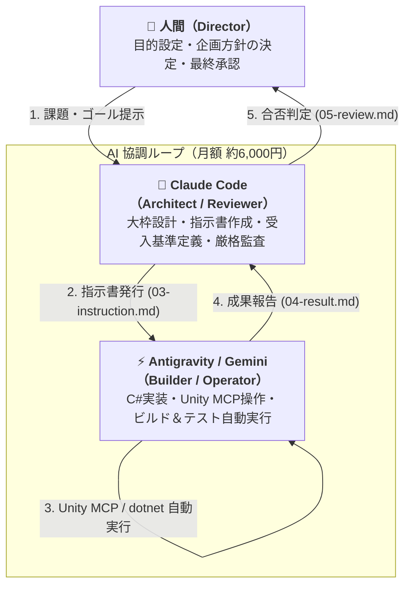
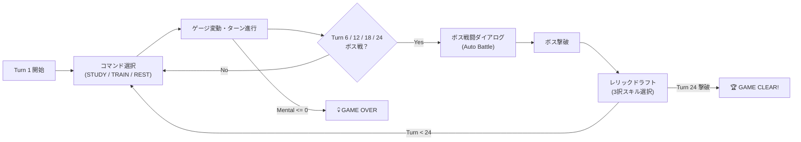

# No-Click Unity: 月6,000円のAI協調体制で挑んだUnity自律開発の記録

> **「人間がUnityエディタを一切触らず（No-Click Unity）、月額約6,000円のAIサブスク（Claude Pro + Gemini Advanced）だけで、どこまでUnityゲームを自律開発・テスト・デバッグできるか？」**  
> 本リポジトリは、この実験的アプローチの全工程、直面したUnity特有の地雷、およびその回避ノウハウを記録した実践開発ログです。

---

## 1. プロジェクトの背景と目的

一般的な「AIでゲーム開発してみた」の多くは、ChatGPTにC#スクリプトを出力させ、人間が手動でUnityエディタに貼り付け、エラーが出たらまた貼り直す……という人間がボトルネックの作業でした。

本プロジェクトではそのアプローチから脱却し、**「人間は一切Unityエディタを触らない」「コード実装・シーン構築・UIバインド・自動テスト・バグ特定をすべてAIエージェントに自律実行させる」** というAIネイティブなパイプラインの構築を目指しました。

また、APIの従量課金で数万円を消費するのではなく、**月額約6,000円（Claude Pro $20 + Gemini Advanced ¥2,900）という個人開発者にとって極めて現実的なコスト**の範囲内で開発サイクルを完結させています。

---

## 2. Triad（三位一体）協調アーキテクチャ

本プロジェクトは、3者の役割を明確に分離した「Triad体制」で進行しました。

### なぜこの分業（Handoff プロトコル）が必要だったのか？
1つのAIチャットにすべてを任せると、以下の致命的な問題が発生します：
1. **コンテキスト長の枯渇**: トラブルシューティングやログが溜まるとすぐにAIの記憶が溢れ、設計方針やルールを忘れる。
2. **自己肯定ハルシネーション**: 自分が書いたコードの欠陥に気づかず、「直しました」と嘘の報告をしてしまう。

これを防ぐため、`docs/handoff/` ディレクトリを用いた**非同期引き継ぎプロトコル（Handoff Protocol）**を構築しました：
* `01-request.md`（人間からの要求）
* `02-context.md`（現状のコード・テスト状態の整理）
* `03-instruction.md`（Claudeによる詳細設計と受入基準チェックリスト）
* `04-result.md`（Antigravityによる実装と生ログ付き検証結果）
* `05-review.md`（Claudeによる厳格な合否判定）

これにより、Git履歴としてすべての設計判断と検証エビデンスが完全に残る開発フローが実現しました。

---

## 3. ツールチェーン：Unity MCP と dotnet CLI のハイブリッド戦略

AIがUnityを自律操作するために、**dotnet CLI** と **Unity MCP (Model Context Protocol)** を適材適所で組み合わせて運用しました。

| ツール | 主な用途 | 利点 / なぜ必要か |
| :--- | :--- | :--- |
| **`dotnet build` (CLI)** | 型チェック、構文エラー検証 | **実行時間 1〜2 秒。** Unityエディタのリフレッシュを待たずに爆速でコンパイル成否を検知できる。 |
| **`refresh_unity` (MCP)** | アセットDB更新、スクリプト再コンパイル | エディタを開いたまま安全にドメインリロードを実行。 |
| **`execute_menu_item` (MCP)** | エディタ拡張機能のキック | UI自動生成ツールやアセット一括置換ツールの実行。 |
| **`run_tests` / `get_test_job` (MCP)** | EditMode / PlayMode テスト非同期実行 | エディタのUIを一切触らず、ヘッドレスに近い形で実機テストを回し結果JSONを取得。 |
| **`read_console` (MCP)** | Unityコンソールログの取得 | 実行時の例外スタックトレースや警告の自動解析。 |

> **知見: なぜどちらか片方だけでは破綻するのか？**  
> * **CLI単体**: Unityエディタのシリアライズ、Prefab化、シーンへのコンポーネント接続、PlayModeテストの実行が極めて重く、人間がUnityを触らざるを得なくなる。
> * **MCP単体**: 構文エラーの検知すら毎回Unityのドメインリロード（15〜30秒）を待つことになり、AIの開発速度が劇的に低下する。  
> → **「dotnet CLI で即座に文法検証」→「MCP でUnityエディタ反映＆実機テスト」** の2段階ゲートが圧倒的に高速でした。

---

## 4. 実際に踏み抜いた「Unity×AIのリアルな地雷」と解決策

自律開発の過程でAIが直面した、**ドキュメントには載っていないUnity特有の地雷**とその回避策です。

### 地雷 1: AIに `.unity`（シーン）や `.asset` を直接編集させると100%破損する
* **現象**: AIにYAML形式の `.unity` や `.asset` を直接テキスト置換させると、m_FileID や GUID の整合性が崩れ、シーンがロード不能になったり参照が Missing になる。
* **解決策**: **「テキスト編集の全面禁止ルール」**を策定。シーンやアセットの構築・変更は、必ず `Game/Assets/Editor/` 配下にエディタ拡張スクリプト（`UILayoutBuilder.cs`, `PlayerFacingTextTools.cs` 等）を作成させ、Unityの `SerializedObject` / `AssetDatabase` API 経由で操作させる。

### 地雷 2: `AssetDatabase.CreateAsset` の罠（GUID再生成破壊）
* **現象**: アセットの更新時に `CreateAsset` を呼ぶと、既存の GUID が再生成されてしまい、シーンや Catalog が保持していた参照がすべて `Missing` に吹き飛ぶ。
* **解決策**: 既存アセットの更新は `CreateAsset` ではなく、`AssetDatabase.LoadAssetAtPath` でロードした後に `SerializedObject` を通してインプレイスに書き換えて `EditorUtility.SetDirty` → `SaveAssets` する。

### 地雷 3: Modal Overlay の Raycast 遮蔽と `SmokeTest` の盲点
* **現象**: ボス戦ダイアログを閉じた後、画面上のレリックカードがクリックできずゲームがフリーズ。しかし PlayMode テストはすべてグリーン（Pass）になっていた。
* **原因**: 
  1. ダイアログ非表示時に子要素のパネルだけを消し、全画面モーダル背景（`raycastTarget = true` を持つ Image）が画面最前面に残っていた。
  2. PlayMode テストで使用していた `ExecuteEvents.Execute` は RaycastTarget を無視してコンポーネントへ直接イベントを送るため、透明な幕で覆われていてもテストが通ってしまっていた。
* **解決策**:
  1. View コンポーネントを常時アクティブなホスト（`UIViews`）へ移設し、非表示化の対象をモーダル背景オブジェクト自身にする。
  2. テストコード（`SmokeTest.cs`）に `GraphicRaycaster.Raycast` を使った**到達可能性アサーション（`AssertRaycastReachesButton`）**を導入。人間がマウスでクリックするのと全く同じ物理的遮蔽判定をテスト内で強制した。

### 地雷 4: TextMeshPro の日本語豆腐化（`□□□`）
* **現象**: 日本語の文字列を UI に流し込むと、TextMeshPro のデフォルトフォント `LiberationSans SDF` が CJK グリフを持たないため、すべて `□`（豆腐）になりフリーズしたように見える。
* **解決策**: プロトタイプ検証フェーズでは巨大な日本語フォントのインポートを後回しにし、プレイヤー向けテキストを ASCII 英語に統一する自動変換ツール（`PlayerFacingTextTools.cs`）と非ASCII検出ツール（`Tools/Report Non-ASCII Player-Facing Text`）を作成して自動担保した。

---

## 5. 完成したゲームループ（PoCの成果物）

人間がUnityを1度も操作することなく、以下の最小ゲームループ（Walking Skeleton）が完全自動で開通しました：

### テスト検証実績
* **EditMode テスト**: **115 件**（ロジック単体テスト、モンテカルロシミュレーション 1,000 周回テストを含む）
* **PlayMode テスト**: **3 件**（Turn 1〜24 の全ボス撃破・ドラフト選択・エンディング到達まで、Raycast 到達性検証を含めて完全走破）
* **コンパイラ・ビルド**: 0 エラー

---

## 6. まとめと今後の展望

本実験を通じて、**「適切なプロトコル（Handoff）」と「Unity専用のエディタ自動化インターフェース（MCP）」** さえ整えれば、月6,000円のAIサブスクリプションだけで、人間がエディタを開くことなくUnityプロジェクトを自律的に構築・テスト・デバッグできることが実証されました。

個人開発において「退屈な配線作業やバグ潰し、シーン構築はAIに丸投げし、人間はゲームの面白さやアートの意思決定に100%集中する」という未来は、すでに現実の技術として手に入っています。
