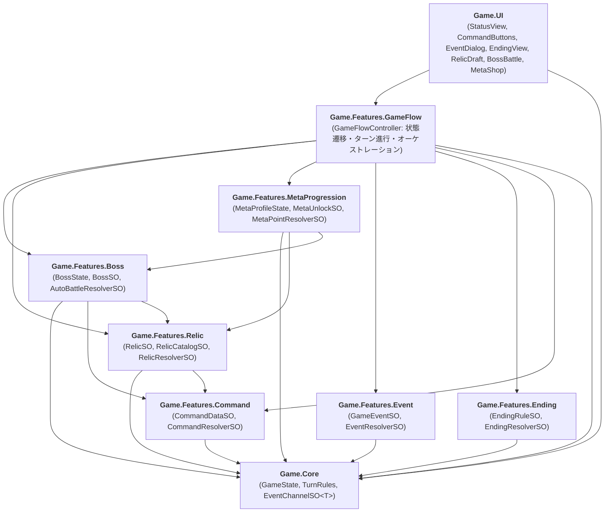

# unity-2d-project

## プロジェクト概要
Unity 2D を使用した育成シミュレーション・ローグライクオートバトラーゲームのプロジェクトです。
本プロジェクトの第一目的は「AIコーディングエージェント（Claude Code ＋ Antigravity / Gemini）に自律開発をどこまで委譲できるか」の工学的検証と工程記録を行うことです。

---

## システムアーキテクチャ（3層分離 ＆ 7層アセンブリ構成）

---

## 開発環境・ツール
- **エンジン**: Unity 6.3 LTS (6000.3.23f1) / 2D / URP / WebGL ビルドターゲット
- **頭脳・監査**: Claude Code（大枠設計・数学モデル策定・網羅的テスト生成・包括的監査レビュー）
- **実動・検証**: Antigravity / Gemini ＋ Unity-MCP（C#実装・Unity操作・シーン結合・テスト実行）
- **テスト実績**: **127 / 127 passed（EditMode 単体テスト 100% Green達成）**
- **モンテカルロシミュレーション**: Act 1〜4 ボス戦闘・レリックドラフト・周回メタ永続化を含む 1,000 周回テスト（24,000ターン以上）が例外ゼロで安定完走
- **自律継続実行インフラ**: Windows Task Scheduler ＋ Antigravity Python SDK による 30分間隔の無人自律開発ランナー（`scripts/auto_runner.py`）を常駐運用

---

## リポジトリ構成
Unity プロジェクト本体は `Game/` 配下に配置されています。
- `Game/Assets/Core/`: 不変状態（`GameState`）、イベントチャンネル基盤
- `Game/Assets/Features/`: 各機能アセンブリ（Command, Event, Ending, Relic, Boss, MetaProgression, GameFlow）
- `Game/Assets/UI/`: 薄いビューコンポーネント群
- `Game/Assets/Tests/`: NUnit EditMode テスト群
- `Game/Assets/Scenes/MainGame.unity`: メイン結合シーン
