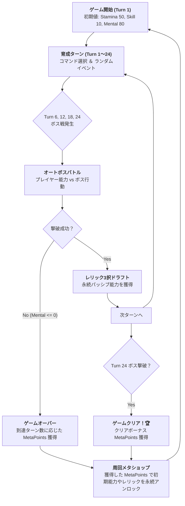

# ゲーム概要書（Game Overview & Design Summary）

本ドキュメントは、本プロジェクトで実装・完成した「2D育成シミュレーション・ローグライクオートバトラー」の全体構造、ルール、UI構成、およびデータ一覧を1枚にまとめたマスター概要書です。

---

## 1. 基本情報

| 項目 | 内容 |
|---|---|
| **ゲームジャンル** | ローグライク育成シミュレーション ＋ オートバトラー |
| **プラットフォーム** | WebGL（ブラウザ） / PC（Unity 6.3 LTS 6000.3.23f1） |
| **1プレイ時間** | 約 3〜5 分（全 24 ターン、Act 1〜4 構成） |
| **開発体制** | Claude Code（頭脳・監査・設計） ＋ Antigravity / Gemini（実動・Unity結合・テスト） |
| **テスト実績** | **127 / 127 passed（EditMode 単体テスト 100% Green達成）** |

---

## 2. ゲームの目的と勝敗条件



* **勝利条件（GameClear）**: 24 ターンを完走し、Turn 24 の最終ボス（Act 4）を撃破する。
* **敗北条件（GameOver）**: 育成中またはボス戦において **`Mental`（精神力）が 0 以下** になる。

---

## 3. ステータスとリソース仕様

| ステータス | 役割と効果 | 減少・枯渇時の挙動 | 対応ピクトグラム・配色 |
|---|---|---|---|
| **Stamina（体力）** | コマンド実行やボス戦での防御・行動持続力 | コマンド実行で消費。0 になると勉強・特訓の効率低下 | ⚡ `Icon_Stamina`（緑 `#38D973`） |
| **Skill（スキル）** | ボス戦で与えるダメージの主軸 | 特訓や勉強で上昇。ボス撃破に必要な攻撃力 | 📘 `Icon_Skill`（青 `#40A6FA`） |
| **Mental（精神力）** | **実質的な生命力（HP）** | 0 になると即座にゲームオーバー。休息で回復 | 💚 `Icon_Mental`（マゼンタ `#E65A9E`） |
| **MetaPoints** | 周回メタ永続化ポイント | ラン終了時に獲得。初期ステータス底上げを購入 | 💎 `Icon_Relic`（ゴールド `#F3CC40`） |

---

## 4. UI 画面構成（幾何学ピクトグラム対応レイアウト）

基準解像度: **1920 x 1080**（16:9 レスポンシブ）

```
+-------------------------------------------------------------------------------+
| [⚡ Stamina: 50]   [📘 Skill: 10]   [💚 Mental: 80]     Turn: 1/24  💎 Points: 0 | <- StatusPanel (上部)
+-------------------------------------------------------------------------------+
|                                                                               |
|                                                                               |
|                            [ 中央ダイアログ領域 ]                             |
|          ・EventDialogPanel (イベント選択肢 A / B)                             |
|          ・BossBattleDialogPanel (👾ボス紋章 + ⚔️HPゲージ + 🛡️シールド)        |
|          ・RelicDraftDialogPanel (3枚の 💎レリックカード枠)                    |
|          ・MetaShopDialogPanel (永続アンロック購入画面)                       |
|          ・EndingPanel (リザルト・獲得ポイント表示)                           |
|                                                                               |
|                                                                               |
+-------------------------------------------------------------------------------+
| [ 📘 勉強 (Study) ]       [ 🥊 特訓 (Train) ]       [ ☕ 休息 (Rest) ]        | <- CommandButtonsPanel (下部)
+-------------------------------------------------------------------------------+
```

---

## 5. データカタログ一覧

### 5.1 育成コマンド
1. **勉強 (`Cmd_Study`)**: Skill +5, Stamina -10, Mental -5
2. **特訓 (`Cmd_Train`)**: Skill +10, Stamina -20, Mental -10
3. **休息 (`Cmd_Rest`)**: Stamina +30, Mental +20

### 5.2 ボスバトル（全4幕構成）
- **Act 1 (Turn 6)**: `Boss_Act1_01`（HP 80, 攻撃力 15, 三角形紋章 👾）
- **Act 2 (Turn 12)**: `Boss_Act2_01`（HP 140, 攻撃力 22, 四角形紋章 👾）
- **Act 3 (Turn 18)**: `Boss_Act3_01`（HP 220, 攻撃力 30, 五角形紋章 👾）
- **Act 4 (Turn 24)**: `Boss_Act4_01`（HP 320, 攻撃力 40, 六角形紋章 👾 - 最終ボス）

### 5.3 レリック（パッシブ能力）
- `Relic_01` (鉄のダンベル): 毎ターン Stamina +5 回復
- `Relic_02` (知恵の書): 勉強・特訓時の Skill 獲得量 +20%
- `Relic_03` (癒やしの護符): ボス戦で受ける Mental ダメージ 30% 軽減

### 5.4 周回メタアンロック
- `Unlock_Stat_Stamina_01` (コスト 50): 次回以降の初期 Stamina +10
- `Unlock_Stat_Skill_01` (コスト 100): 次回以降の初期 Skill +5
- `Unlock_Stat_Mental_01` (コスト 150): 次回以降の初期 Mental +15
