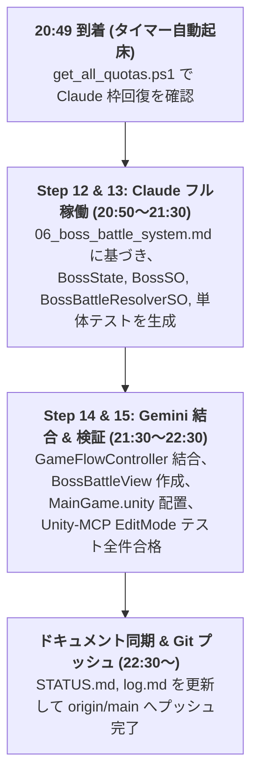

# 7日間 デュアルAI完全消化・商業化ロードマップ（PLAN_ROADMAP）

最終更新日：2026-09-02

---

## 1. 基本方針とリソース運用原則

1. **デュアルAI日割り消化基準**:
   - **Claude Code**: 1日あたり **約 14.3%** を消費（5hセッション枠を 1日 1〜2回、80%まで使い倒す）。
   - **Gemini Models**: 1日あたり **約 15.3%** を消費（アセット生成・シーン結合・シミュレーション・テスト）。
2. **夜間自律開発パイプライン（Overnight Autonomous Pipeline）**:
   - 人間の指示が出せない夜間帯は、仕様・アーキテクチャが確定しているタスク（第5週ボスシステム等）を、Claude（コアロジック・テスト生成）→ Gemini（Unity結合・テスト検証）のリレー形式で一気通貫に自律完走させる。
3. **実績評価と計画の動的調整（Living Plan）**:
   - 各ステップ完了時、単体テスト結果および実測クォータ消費実績（`scripts/get_all_quotas.ps1`）を評価し、翌日のタスク配分を動的に最適化する。

---

## 2. 7日間のタスク配分マトリクス

| 日程 | 目標フェーズ | **Claude Code 担当（頭脳: 14.3%/日）** 【設計・数学モデル・C#コア・監査】 | **Gemini 担当（手足: 15.3%/日）** 【Unity-MCP・アセット・UI・テスト】 |
|---|---|---|---|
| **Day 1 (9/2 今夜)** | **第4週完了 ＆ 第5週ボス基盤** | **【20:49〜 夜間自律実行】**: `BossSO`, `BossState`, `BossBattleResolverSO` のコアロジック & 単体テスト生成 (Step 12-13) | レリック6点アセット生成、MainGameシーン結合、1,000回シミュレーション（完了済み） **【夜間】**: Step 14-15 の GameFlow・UI結合 |
| **Day 2 (9/3 明日)** | **第5週 ボスバトル統合 ＆ UIシーン結合** | 複数ボスAI（通常ボス・強敵・ラスボス）、シールドブレイク・属性耐性の数学モデル & テスト | `GameFlowController` への `BossBattle` 統合、`BossBattleView` 実装、シーン配置・テスト通過確認 |
| **Day 3 (9/4)** | **第6週 複数キャラ ＆ 初期ビルド選択** | 3種キャラクター（剛力型・俊足型・精神型）の固有パッシブ・初期デッキ設計 (Step 16) | キャラ選択画面 (`CharacterSelectView`)、パラメータ初期化配線、単体テスト |
| **Day 4 (9/5)** | **メタプログレッション ＆ 実績アンロック** | 周回引き継ぎポイント（ソウル）、アンロックツリーの数学モデル & セーブデータ設計 (Step 17) | 暗号化セーブロード、実績アンロックUI (`UnlockTreeView`)、永続化テスト |
| **Day 5 (9/6)** | **演出強化 ＆ 第2回総合監査** | **第2回 包括的アーキテクチャ監査（Audit-02）** による全体リファクタリング & 指摘修正 | BGM / SE オーディオチャンネル統合、Tween アニメーション、ゲージ演出 |
| **Day 6-7 (9/7-8)** | **最終バランシング ＆ 商業化パッケージング** | 最終バランシング（クリア率 30% に調整するパラメータ調整）、ペンネーム本販売用ガワ分離設計 | 10,000回自動プレイ検証、WebGL 最適化ビルド、GitHub Pages デプロイ |

---

## 3. 今夜の夜間自律実行スケジュール（20:49〜）

